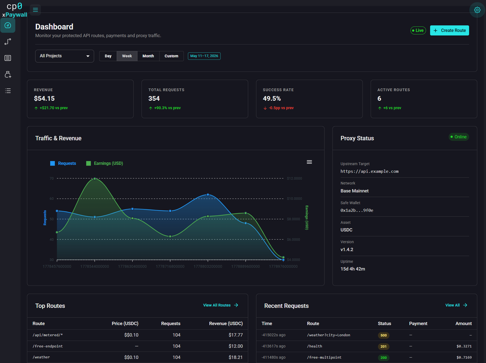

# xpaywall

**xpaywall** is a self-hosted HTTP 402 payment gateway that enforces micropayments in front of any API. It sits between clients and your upstream services — no API keys, no billing accounts, no subscriptions. Clients pay per request using crypto (x402, MPP/Tempo) or Stripe, and the gateway proxies the request only after verifying payment proof.

---

## How It Works

```
Client Request
     │
     ▼
┌─────────────┐    no payment     ┌─────────────────────────────┐
│  xgateway   │ ────────────────► │  HTTP 402 + payment details │
│  :8081      │                   └─────────────────────────────┘
│             │    proof verified
│             │ ────────────────► Upstream API → response → client
└──────┬──────┘
       │ resolves rules
       ▼
┌─────────────┐
│ control-api │  ◄── Admin Panel (React)
│  :9091      │
└──────┬──────┘
       │
       ▼
┌─────────────┐
│ PostgreSQL  │
└─────────────┘
```

1. Client hits xgateway at any path
2. Gateway resolves the payment rule for that path
3. No valid proof → returns `HTTP 402` with payment requirements
4. Client pays on-chain and retries with proof header
5. Gateway verifies proof → proxies request to upstream → logs result

---

## Admin Dashboard



---

## Services

| Service | Directory | Container Port | Role |
|---|---|---|---|
| **xgateway** | `xgateway/` | 8081 | Reverse proxy that enforces payment rules |
| **control-api** | `control-api/` | 9091 | REST control plane — projects, routes, users, logs |
| **adminpanel** | `frontend/adminpanel/` | 80 (3000 in dev) | React dashboard for managing everything |
| **example-server** | `examples/server/` | 4021 | Sample upstream API for testing |

---

## Quick Start

### With Docker Compose

```bash
git clone https://github.com/your-org/xpaywall.git
cd xpaywall
docker compose up -d
```

| Service | URL |
|---|---|
| Admin Panel | http://localhost:3100 |
| Control API | http://localhost:3101 |
| Gateway | http://localhost:3102 |
| Example upstream | http://localhost:3103 |
| PostgreSQL | localhost:5482 |

Default superadmin credentials: `superadmin` / `superadmin` (change in `docker-compose.yml`). Host ports are mapped in `docker-compose.yml` — adjust them there if you need different externals.

### Local Development

**Prerequisites:** Go 1.26+, Node.js 22+, Yarn 4, PostgreSQL 16, Docker

**control-api:**
```bash
cd control-api
go run ./cmd/control-api --env-file .env install   # run migrations
go run ./cmd/control-api --env-file .env           # start server
```

**xgateway:**
```bash
cd xgateway
go run ./cmd/xgateway --env-file .env
```

**adminpanel:**
```bash
cd frontend/adminpanel
yarn install
yarn start
```

---

## Configuration

### docker-compose.yml

All service configuration lives in `docker-compose.yml`. The key values to change before deploying:

```yaml
control-api:
  environment:
    INTERNAL_API_KEY: change-me-internal-secret-key   # shared with xgateway
    JWT_SECRET: change-me-jwt-secret-key
    PROXY_URL: http://your-server-ip:3102             # public gateway URL
    MODE: release                                     # Gin mode: release | debug
    SUPERADMIN_USERNAME: admin
    SUPERADMIN_PASSWORD: your-strong-password

xgateway:
  environment:
    INTERNAL_API_KEY: change-me-internal-secret-key   # must match control-api

adminpanel:
  environment:
    API_URL: http://your-server-ip:3101/              # browser-accessible URL
    PROXY_URL: http://your-server-ip:3102/
```

> **Note:** `API_URL` and `PROXY_URL` for the admin panel are runtime env vars — you can change them without rebuilding the image.

---

### xgateway Environment Variables

| Variable | Required | Description |
|---|---|---|
| `CONFIG_PROVIDER` | Yes | `file` (YAML) or `http` (control-api) |
| `CONTROL_API_URL` | http mode | URL of control-api, e.g. `http://control-api:9091` |
| `INTERNAL_API_KEY` | http mode | Shared secret — must match control-api |
| `CONFIG_FILE` | file mode | Path to YAML rules file |
| `PORT` | No | Listen port (default: `8080`) |
| `LOG_LEVEL` | No | `DEBUG`, `INFO`, `WARN`, `ERROR` |
| `GIN_MODE` | No | `debug` or `release` |
| `PUBLIC_URL` | No | Override the public-facing URL injected into 402 responses |

### control-api Environment Variables

| Variable | Required | Description |
|---|---|---|
| `CONTROL_DB_DSN` | Yes | PostgreSQL DSN |
| `INTERNAL_API_KEY` | Yes | Shared secret with xgateway |
| `JWT_SECRET` | Yes | Signs admin JWT tokens |
| `PROXY_URL` | Yes | Public URL of xgateway (returned in 402 responses) |
| `PORT` | No | Listen port (default: `9090`) |
| `MODE` | No | Gin mode: `release` or `debug` |
| `SUPERADMIN_USERNAME` | No | Bootstrap admin username |
| `SUPERADMIN_PASSWORD` | No | Bootstrap admin password |

---

## File-Based Config (xgateway)

When `CONFIG_PROVIDER=file`, rules are loaded from a YAML file at startup:

```yaml
x402:
  - name: base-exact
    facilitator_url: https://x402.dexter.cash
    network: eip155:8453        # Base mainnet (CAIP-2)
    scheme: exact               # exact | upto
    merchant: "0xYourAddress"        # pay_to address
    asset: "0xUSDCAddress"           # CAIP-19 asset

mpp:
  - name: tempo-charge
    method: tempo
    rpc_url: http://localhost:4022
    scheme: charge
    merchant: "0xYourAddress"        # pay_to address
    asset: "0xUSDCAddress"           # CAIP-19 asset

outbound:
  target: http://your-upstream:4021
  allow_unmatched: false        # 403 for paths with no rule
  rules:
    - name: weather
      path: /weather
      price: "$0.10"
      payment_methods: [base-exact]

    - name: health-check
      path: /health
      free: true                # no payment required
```

---

## Payment Methods

| Protocol | Description | Networks |
|---|---|---|
| **x402** | EVM-based micropayments | Base, Base Sepolia |
| **MPP / Tempo** | Machine Payments Protocol | Tempo blockchain |
| **Stripe** | Traditional card payments | — |

---

## Tech Stack

**xgateway & control-api** — Go 1.26, Gin, pgx/v5, sqlc, goose, urfave/cli/v3

**adminpanel** — React 19, TypeScript, MUI v7, Redux Toolkit, Vite 7, Axios

**Infrastructure** — PostgreSQL 16, nginx, Docker

---

## API Overview

### control-api

| Method | Path | Auth | Description |
|---|---|---|---|
| POST | `/auth/login` | — | Get JWT token |
| GET | `/auth/me` | JWT | Current user info |
| GET/POST | `/api/v1/projects` | JWT | List / create projects |
| GET/PUT/DELETE | `/api/v1/projects/:id` | JWT | Get / update / delete project |
| GET/POST | `/api/v1/outbound-routes` | JWT | Manage payment routes |
| GET | `/api/v1/payment-channels` | JWT | List payment channels |
| GET | `/api/v1/stats/dashboard` | JWT | Dashboard stats |
| GET | `/api/v1/request-logs` | JWT | Paginated request logs |
| GET | `/proxy/resolve/*path` | API Key | Rule resolution (used by xgateway) |
| POST | `/api/v1/request-logs` | API Key | Log ingestion (used by xgateway) |
| POST | `/api/v1/request-events` | API Key | Per-step event ingestion (used by xgateway) |

---

## Development

### control-api

```bash
# Run migrations manually
go tool goose -dir migrations postgres "$CONTROL_DB_DSN" up

# Regenerate sqlc (never hand-edit internal/storage/postgres/generated/)
sqlc generate

# Tests & lint
go test ./...
golangci-lint run
```

### xgateway

```bash
go test ./...
go test -run TestName ./internal/rules/
golangci-lint run
```

### adminpanel

```bash
yarn tsc          # type-check
yarn lint         # eslint
yarn lint:fix
yarn prettier
yarn build        # production build
```

---

## Project Structure

```
xpaywall/
├── xgateway/               # Payment proxy service
│   ├── cmd/xgateway/       # Entry point
│   └── internal/
│       ├── proxy/          # Gin server, payment verification, upstream proxy
│       ├── rules/          # Rule providers (file, http)
│       └── logger/         # Async log client
│
├── control-api/            # Control plane
│   ├── cmd/control-api/    # Entry point + install subcommand
│   ├── internal/
│   │   ├── http/           # Gin routes, handlers, middleware
│   │   └── storage/postgres/
│   │       ├── generated/  # sqlc output — do not edit
│   │       └── queries/    # SQL query definitions
│   └── migrations/         # goose SQL migrations
│
├── frontend/adminpanel/    # React admin dashboard
│   └── src/
│       ├── api/            # Typed axios wrappers
│       ├── views/          # Page components
│       ├── store/          # Redux slices
│       └── utils/axios.ts  # HTTP client (reads window.__CONFIG__)
│
├── examples/server/        # Sample upstream API
└── docker-compose.yml
```

---

## License

MIT
