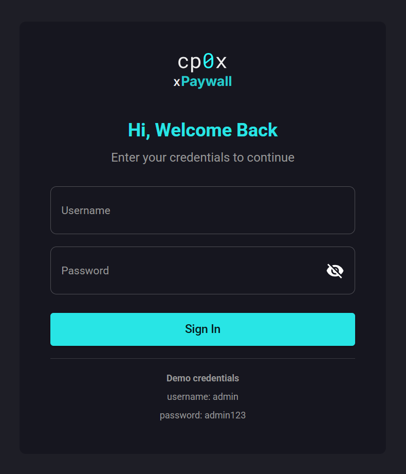

# 02 — Setup

This page walks you through getting xpaywall running on your machine in HTTP mode (the full stack). If you only want to run the gateway with a YAML file, jump to [07 — xgateway / File mode](./07-xgateway/03-file-mode.md) instead.

## Prerequisites

You need:

- **Docker** and **Docker Compose**. On Windows or macOS, install [Docker Desktop](https://www.docker.com/products/docker-desktop/). On Linux, install the Docker Engine and the `docker compose` plugin.
- A free terminal and a web browser.
- The xpaywall source code (a `git clone` of the repository).

You do **not** need:
- Go, Node.js or Yarn (Docker handles all builds).
- A blockchain wallet for the first boot — you only need one once you start *making* a paid request as a client. For configuring routes from the admin panel, no wallet is required.

About **ports**: by default xpaywall exposes the services on these host ports. Make sure nothing else is using them, or change them in `docker-compose.yml` before starting.

| Service | Default host port | Purpose |
|---|---|---|
| Landing page | `3100` | Optional landing site |
| control-api | `3101` | REST backend |
| xgateway | `3102` | The proxy — clients call this URL |
| example-server | `3103` | Sample upstream API |
| admin panel | `3104` | Web UI |
| PostgreSQL | `5482` | Database |

---

## Step 1 — Clone and start

From a terminal:

```bash
git clone https://github.com/cp0x-org/xpaywall.git
cd xpaywall
git submodule update --init --recursive
docker compose up -d
```

> `xgateway/` is a Git submodule — don't skip the `submodule update` step or the build fails.

The first run downloads images and builds the containers — expect a few minutes. When the command returns, run `docker compose ps` to confirm all containers say `running` or `healthy`.

---

## Step 2 — Open the admin panel

Open `http://localhost:3104` in your browser.

You will see a login page. The default credentials are taken from `docker-compose.yml`:

- **Username:** `admin`
- **Password:** `admin123`

Log in.

 You should land on the Dashboard — an empty one, because you have not configured anything yet.


> **Important:** the default `admin / admin123` credentials are good for the first login only. Change them right away by editing `SUPERADMIN_USERNAME` and `SUPERADMIN_PASSWORD` in `docker-compose.yml` and restarting the `control-api` container. See [09 — Security](./09-security.md) for the production checklist.
>
> Need additional login accounts? The admin panel does not yet have a Users screen — create them with `docker compose run --rm control-api install user`. See [12 — control-api CLI](./12-cli.md).

---

## Step 3 — Sanity check

Couple quick checks that confirm everything is wired up correctly.

### xgateway responds

```bash
curl http://localhost:3102/healthz
```

Should return something like:

```json
{"status":"ok","started_at":"...","uptime_seconds":...}
```

### example-server responds

```bash
curl http://localhost:3103/weather
```

Should return a sample weather payload. The example server has no payment enforcement of its own — xpaywall will wrap it in step 4.

---

## Step 4 — (Optional) seed demo data

If you want a stack that already has a project, payment method, routes and a few hundred fake request logs to explore — instead of building everything from scratch — run the demo seeder once:

```bash
docker compose run --rm control-api install demo
```

That creates an `admin` / `admin` account, a **Default Project**, six routes against the bundled example-server, and 75 randomised entries in `request_logs`. The seed is idempotent, so re-running it is safe.

Full flag reference and the dedicated `control-api-cli` profile are documented in [12 — control-api CLI](./12-cli.md).

---

## Step 5 — Add your first paid route

The stack is up but nothing is monetised yet (unless you ran the demo seed in Step 4). Continue to the step-by-step tutorial: [Guide 01 — Add your first paid route](./06-guides/01-first-paid-route.md). It walks through creating a facilitator, an asset, a payment method, a project, attaching the method to the project, creating a route, and verifying the result with curl.

---

## Stopping and resetting

To stop xpaywall without deleting data:

```bash
docker compose stop
```

To start again where you left off:

```bash
docker compose start
```

To wipe everything and start fresh (this deletes the database too):

```bash
docker compose down
```

---

## Next steps

- Configure ports, secrets and production-readiness: [03 — Configuration](./03-configuration.md).
- Walk through your first paid route end-to-end: [Guide 01](./06-guides/01-first-paid-route.md).
- Understand what each piece of the admin panel does: [04 — Admin panel](./04-admin-panel/01-login-and-users.md).
- Add additional users, migrate schema, seed demo data: [12 — control-api CLI](./12-cli.md).
