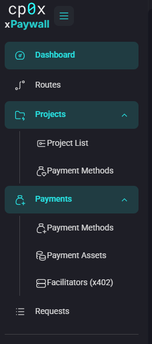

# Admin Panel — Login & Users

The admin panel is a small web app at `http://<your-host>:3104` (port `3104` by default). Projects, payment methods and routes are all managed here.

> **Users are not yet managed from the panel.** Creating, editing and deleting login accounts is done from the control-api CLI today. The user management UI is on the [roadmap](./../11-roadmap.md). See [12 — control-api CLI](./../12-cli.md) for the commands you have today.

## First login

When the stack starts for the first time, control-api creates a single **superadmin** account using the `SUPERADMIN_USERNAME` and `SUPERADMIN_PASSWORD` environment variables. In a fresh `docker-compose.yml` both are set to `superadmin`.

Open the login page, enter the credentials, and submit.


After login you land on the Dashboard. The left sidebar gives you access to every other section.



> **Change the default password before exposing the panel to the internet.** Edit `SUPERADMIN_PASSWORD` in `docker-compose.yml` and restart `control-api` — the bootstrap logic re-syncs the account credentials on the next boot. There is no in-panel password form yet.

## Creating additional users

There is no Users screen in the admin panel. Add accounts from the CLI:

```bash
docker compose run --rm control-api install user \
  --username alice \
  --password 'choose-a-long-passphrase'
```

The CLI hashes the password with bcrypt before storing it. Run it once per account you want to create. The new account can log in immediately — no restart required.

For local development without Docker:

```bash
cd control-api
go run ./cmd/control-api --env-file .env install user --username alice --password 'choose-a-long-passphrase'
```

See [12 — control-api CLI](./../12-cli.md) for full flag reference and the dedicated `control-api-cli` Docker Compose profile.

## Seeding a complete demo workspace

If you want a ready-to-explore stack (admin user, sample project, payment method, routes, and ~75 fake request logs), use the demo seeder:

```bash
docker compose run --rm control-api install demo
```

That gives you an `admin` / `admin` account plus a **Default Project** with realistic data behind it. Full details in [12 — control-api CLI](./../12-cli.md#install-demo--seed-a-demo-workspace).

## Roles

Today every login account has the same level of access — there is no separate "superadmin vs user" enforcement on the API side beyond the bootstrap account. Project-level ownership controls who can edit which project:

| Capability | Who can do it |
|---|---|
| Log in to the admin panel | Any account in the `users` table. |
| Create a project | Any logged-in account. The creator becomes the project owner. |
| Edit / archive a project | The owner of that project. |
| Manage payment methods, facilitators, assets | Any logged-in account. |

Tighter role separation (a dedicated `superadmin` flag, per-project member lists) is on the [roadmap](./../11-roadmap.md).

## Losing access to the only account

If you lose the password and the bootstrap account is the only one left:

1. Set or update `SUPERADMIN_USERNAME` / `SUPERADMIN_PASSWORD` in `docker-compose.yml`.
2. Restart control-api: `docker compose restart control-api`.

control-api re-creates the bootstrap account on boot if it is missing, and resyncs the password if it has changed.

If the bootstrap env vars are unset and you cannot log in, restore the database from a backup or create a new account directly with `install user`:

```bash
docker compose run --rm control-api install user --username recovery --password '<long-passphrase>'
```

## What's next?

- See what the home page shows: [Dashboard](./02-dashboard.md).
- Start setting up payments: [Facilitators](./03-facilitators.md).
- Full CLI reference: [12 — control-api CLI](./../12-cli.md).
