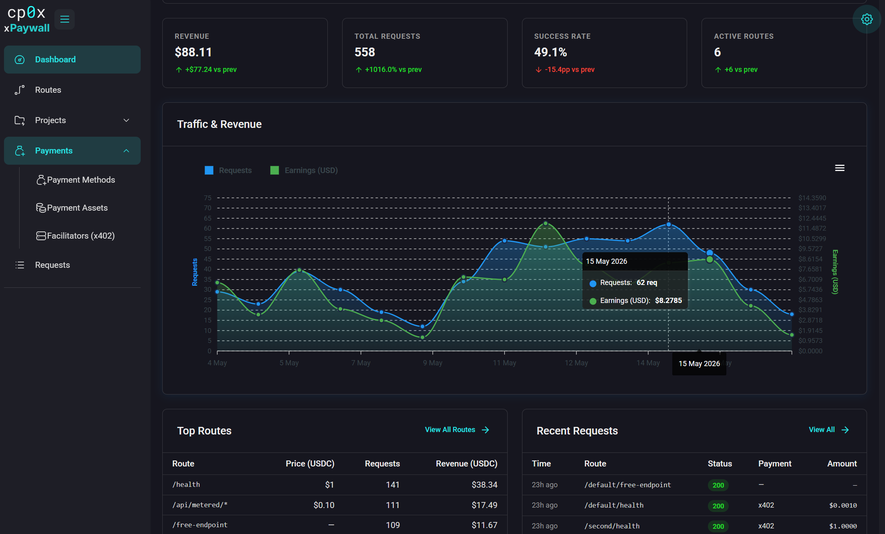
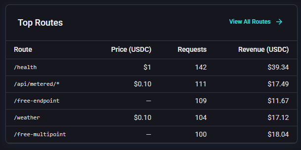
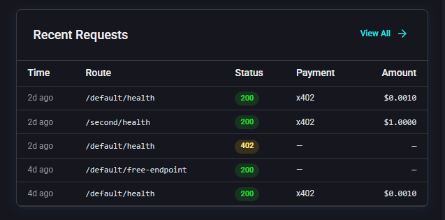

# Admin Panel — Dashboard

The Dashboard is the first page you see after logging in. It is a read-only summary of the activity going through the gateway.

## Summary cards

The top of the page shows aggregate counters. Typical cards:

- **Revenue** — how much the gateway has earned from successful payments.
- **Total requests** — every request the gateway has handled.
- **Success Rate** — the percentage of requests that got a successful payment proof and were proxied to the upstream. A low success rate means many clients are starting the payment flow but not finishing it.
- **Active Routes** — how many routes are enabled. 

## Top routes

A list of the most-hit routes in the selected period, with revenue and call counts. Useful for spotting your most profitable endpoints and your highest-traffic ones.

## Recent requests

A timeline of the latest individual requests. Click through to open the **Requests** page filtered to that request for full details.

## What if it's empty?

A fresh installation has no data. The Dashboard fills in after you:
1. Configure at least one route — see [Routes](./08-routes.md).
2. Have a client (or yourself, with curl) actually hit the gateway — see [Guide 03 — Testing with curl](./../06-guides/03-testing-with-curl.md).

If you have made requests but the Dashboard still shows zeros, jump to [08 — Troubleshooting](./../08-troubleshooting.md). Most often the cause is that the gateway is in **file mode** (which does not send logs to control-api) or that `CONTROL_API_URL` is not set correctly.

## What's next?

- Drill into individual requests: [Requests](./09-requests.md).
- Add a payment configuration so the counters start moving: [Facilitators](./03-facilitators.md).
