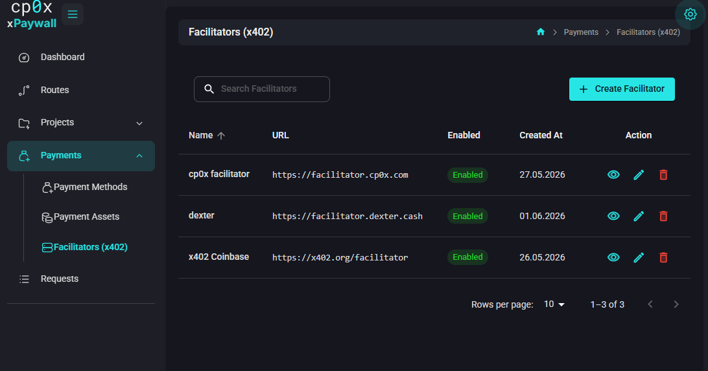

# Admin Panel — Facilitators

A **facilitator** is an external service that verifies x402 payment proofs and settles them on-chain on behalf of the gateway. The gateway itself never needs a hot wallet or signing keys — it forwards each proof to the facilitator and trusts the facilitator's verdict.

If you have never seen the word before, it is the easiest mental model: *facilitator = the verifier*.

## Why facilitators exist

x402 payments can be made on different networks (Base, Base Sepolia, etc.) and with different assets (USDC and others). For the gateway to verify a proof, *something* has to:

1. Reach out to the blockchain.
2. Check that the payment is real and final.
3. Optionally execute the settlement transaction.

That something is a facilitator. 

There are public ones available, and you can use them as long as they support the network and asset you want to accept. You can also run your own if you want to — the x402 reference implementation is open source.

## Adding a facilitator

From the sidebar, open **Payments → Facilitators (x402)** and click **Create Facilitator**.

Fill in:

| Field | What to put |
|---|---|
| **Name** | A label for yourself, shown across the admin panel. Example: `Coinbase x402 Facilitator`. |
| **URL** | The HTTPS endpoint of the facilitator. Example: `https://x402.org/facilitator`. |
| **Enabled** | Leave on. Switch it off to keep the row but stop using it. |

Save. The facilitator is now available to attach to payment methods.

## Some public facilitators

You will typically use one of these for starters:

- `https://x402.org/facilitator` — the reference facilitator from the x402 community. Supports Base Sepolia (testnet) and several mainnet networks. Good for development.
- `https://x402.dexter.cash` — another public option.

Always re-check current URLs against the facilitator operator's own documentation before going to production. Network support and rate limits change over time.

## Edit / delete

You can edit URL and name at any time. You cannot delete a facilitator that is still referenced by an active project payment method — first detach it from any **Project Payment Method** that uses it.

## What's next?

- A facilitator alone does nothing — it needs an asset and a payment method to be useful: [Payment Assets](./04-payment-assets.md).
- Big picture for how payment configuration fits together: [Guide 01 — Add your first paid route](./../06-guides/01-first-paid-route.md).
