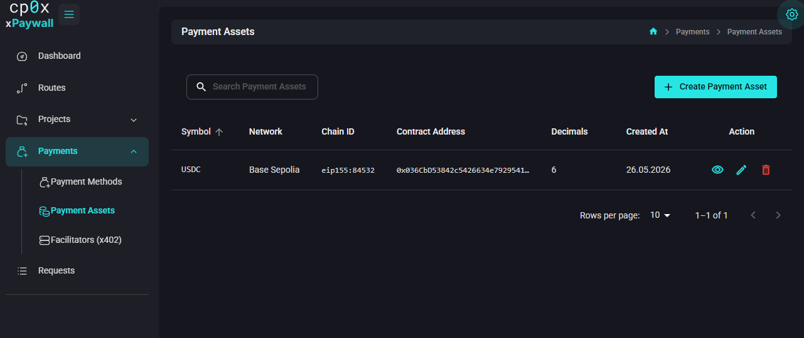

# Admin Panel — Payment Assets

A **payment asset** is the currency the client pays in. Typically a stablecoin like USDC on a specific blockchain network.

Each asset is attached to a payment method (you create the payment method first, then add assets for it). The same payment method can have several assets — for example USDC on Base Mainnet and USDC on Base Sepolia — and you pick which one a project accepts when you link a payment method to a project.

## Fields

Open **Payments → Payment Assets** and click **Create Payment Asset**.

| Field | What to put |
|---|---|
| **Payment Method** | Pick from the dropdown. The asset belongs to a single payment method. If your method list is empty, create one first — see [Payment Methods](./05-payment-methods.md). |
| **Symbol** | A short label, e.g. `USDC` or `USDT`. Free-form, but use the common ticker so it is easy to recognise in dropdowns. |
| **Contract Address** | The token contract address on the network of the parent payment method. Required for ERC-20 tokens; leave blank only for a native chain token. Example for USDC on Base Mainnet: `0x833589fCD6eDb6E08f4c7C32D4f71b54bdA02913`. |
| **Decimals** | The number of decimal places the on-chain amount uses. USDC = `6`, most other ERC-20 tokens = `18`. |

> **Why decimals matter.** Prices in xpaywall are stored as USD strings (e.g. `0.10`). When the gateway tells the client to pay, it multiplies the USD price by `10 ** decimals` to compute the raw on-chain amount. If you set the wrong decimals you will charge the wrong amount. USDC on every EVM network is `6`. ETH is `18`. Always double-check.

## Common values

| Asset | Network | Decimals | Contract address |
|---|---|---|---|
| USDC | Base Mainnet | `6` | `0x833589fCD6eDb6E08f4c7C32D4f71b54bdA02913` |
| USDC | Base Sepolia (testnet) | `6` | `0x036CbD53842c5426634e7929541eC2318f3dCF7e` |

For other networks and assets, look up the official token address on the issuer's documentation (Circle for USDC, Tether for USDT, etc.).

## Edit / delete

Symbol, contract address and decimals can all be edited. You **cannot delete an asset** that is still referenced by an enabled **Project Payment Method**. Disable or delete those links first.

## What's next?

- Assets are useless without a parent method — see [Payment Methods](./05-payment-methods.md).
- See how everything attaches to a project: [Project Payment Methods](./07-project-payment-methods.md).
