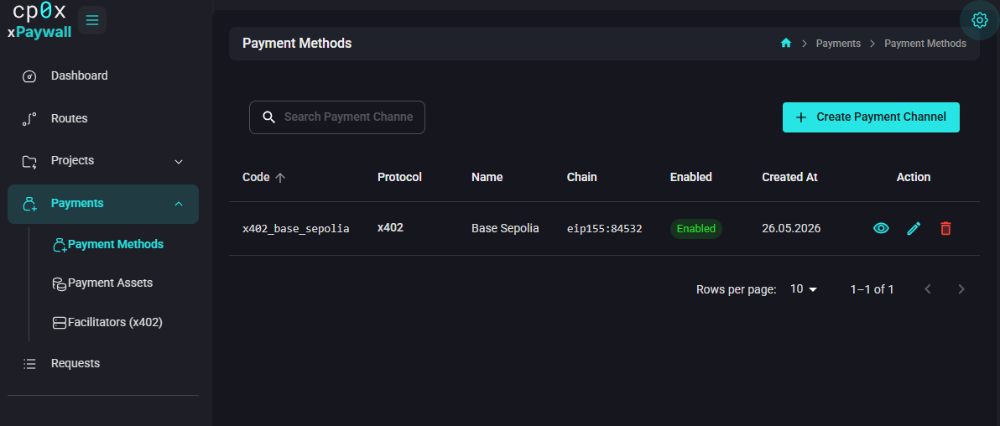

# Admin Panel — Payment Methods

A **payment method** is a template for "this protocol on this network". It says, for example, "x402 on Base Mainnet", or "MPP via Tempo". It does not yet say which asset, which facilitator or which wallet receives the money — those come from assets and from the per-project link.

You define payment methods once, then reuse them across many projects.

## Fields

Open **Payments → Payment Methods** and click **Create Payment Method**.

| Field | What to put |
|---|---|
| **Code** | A unique short identifier. Lowercase letters, digits and hyphens. Example: `x402-base-usdc`. You will see it everywhere in the UI alongside the human name, so make it descriptive. |
| **Protocol** | `x402` or `MPP`. The fields below the protocol change with your choice: x402 uses a **Network**; MPP (Machine Payments Protocol) uses a **Method** and **Scheme**. |
| **Name** | Human-readable label, e.g. `Base Mainnet` or `Tempo Charge`. For x402, the select-network mode fills this in for you; for MPP it is optional. |
| **Network** *(x402)* | Pick a network from the dropdown, or switch to **Custom** to type a CAIP-2 chain ID directly. |
| **CAIP-2 Chain ID** *(x402)* | Auto-filled when you pick a known network. For custom entries, format is `eip155:<chainId>`. Examples: `eip155:8453` (Base Mainnet), `eip155:84532` (Base Sepolia). |
| **Method** *(MPP)* | `tempo` or `stripe`. Only `tempo` works end-to-end today — `stripe` is accepted by the form but rejected by the gateway. |
| **Scheme** *(MPP)* | `charge` — a one-time on-chain charge. (The `session` scheme is planned; see [11 — Roadmap](./../11-roadmap.md).) |
| **Enabled** | Leave on. Switching off keeps the row but stops the method appearing in selections. |

### Network: select vs custom (x402)

For an MPP method there is no network — the form shows **Method** and **Scheme** selectors instead. The toggle below applies to x402 methods only.

The form has a toggle between **Select network** and **Custom**.

- **Select network** — pick from a curated list of CAIP-2 chains known to control-api. This is the safer option; the name and ID stay in sync.
- **Custom** — type any `eip155:<chainId>` you like, plus your own human name. Use this only when the network you need is not in the list.

## What "payment method" means in practice

A payment method on its own does not let anyone pay. You always combine three things:

1. **Payment Method** — protocol + network (this page).
2. **Payment Asset** — what coin (USDC, etc.) on this method's network.
3. **Project Payment Method** — links the method+asset to a specific project, with a payout address and a facilitator.

Think of payment method as the *protocol/network slot* and asset as the *currency slot* — they slot together when you attach them to a project.

## Edit / delete

You can rename, change the protocol/network or disable an existing method. You **cannot delete** a method that has assets or active project links pointing at it — clean those up first.

## What's next?

- Add at least one asset for this method: [Payment Assets](./04-payment-assets.md).
- Then attach the method+asset combo to a project: [Project Payment Methods](./07-project-payment-methods.md).
