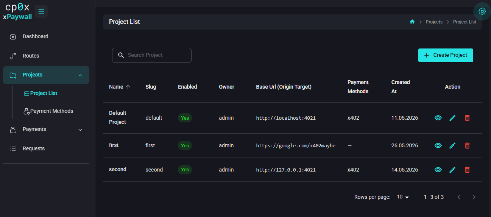
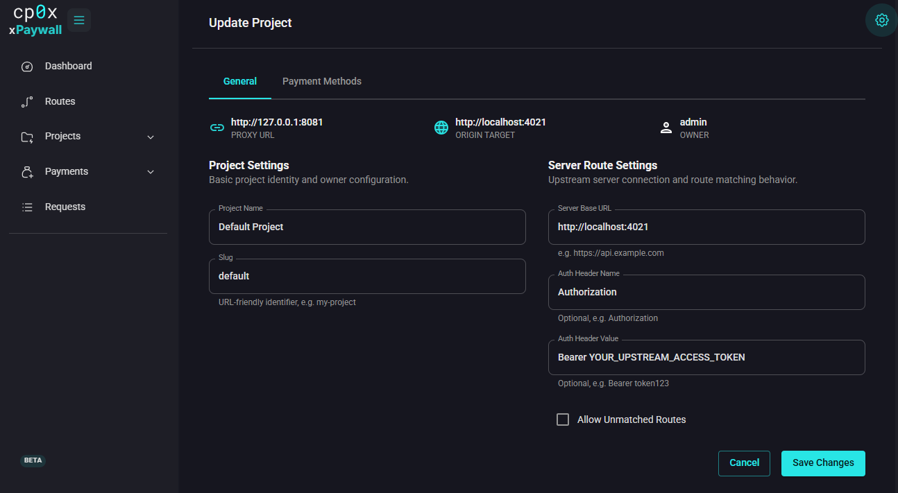

# Admin Panel — Projects

A **project** groups everything related to one API you want to monetise:

- the upstream URL the gateway forwards to,
- the routes (paths) you allow and their prices,
- the payment methods you accept,
- the owner (which user account controls it).

Most installations have one project per API. You can have several projects on the same gateway — each lives at its own URL prefix.



## Creating a project

Open **Projects → Project List** and click **Create Project**. The form has two columns.



### Project Settings

| Field | What to put |
|---|---|
| **Project Name** | A human label for the project, e.g. `Weather API`. |
| **Slug** | URL-friendly identifier. Letters, digits, `_` and `-` only. Example: `weather-api`. The slug appears after your username on the gateway URL: `https://gateway.example.com/<username>/<slug>/...`. It is unique **per user** — two users can each own a `weather-api` project. The form auto-suggests one from the name; you can edit it. |

### Server Route Settings

| Field | What to put |
|---|---|
| **Server Base URL** | The full URL of your upstream API. Example: `https://api.example.com`. The gateway forwards every matched request to this base URL plus the route path. |
| **Auth Header Name** | Optional. If your upstream needs an authentication header, name it here. Example: `Authorization`. |
| **Auth Header Value** | Optional. The value the gateway should send in that header. Example: `Bearer sk_live_abc123`. The header is injected on every proxied request and never sent back to clients. |
| **Allow Unmatched Routes** | If on, paths that have no rule are still proxied (without payment). If off, unmatched paths return 403 Forbidden. Default off. **Recommended off** unless you understand why you need it. |

After saving, the project also gains a **Payment Methods** tab. You add per-project payment methods there — see [Project Payment Methods](./07-project-payment-methods.md).

## Slug — why it matters

The slug is part of every request URL the gateway answers, after your username. If your gateway is at `https://gateway.example.com`, you log in as `alice`, and your project slug is `weather-api`, then a route with path `/forecast` is served at:

```
https://gateway.example.com/alice/weather-api/forecast
```

The slug only has to be unique among **your** projects — another user can have their own `weather-api`. You cannot change it after a project has been used in production without breaking client URLs. Choose carefully.

## Allow Unmatched — what it does

xpaywall by default rejects any path that does not match a configured route. This is the safe behaviour. If you turn **Allow Unmatched Routes** on, the gateway will proxy any path that does not match a rule **without requiring payment**. This effectively turns those paths into free, public endpoints.

Use it when:
- You want a partial migration where most paths are free and only a few are paid.
- You want to forward everything except a small list of priced endpoints.

Do not use it when:
- You want strict pay-per-call across the whole project. Leave it off so unknown paths get a clear `403`.

## Ownership

Each project has an owner (the user who created it). Superadmins can manage any project. Regular users can manage only the projects they own.

The owner field is shown on the project view but cannot be reassigned from the UI in this version. To transfer ownership, either delete and recreate the project, or contact a superadmin.

## What's next?

- Attach a payment method to the project so paid routes can collect money: [Project Payment Methods](./07-project-payment-methods.md).
- Add routes (paths) that the project responds to: [Routes](./08-routes.md).
