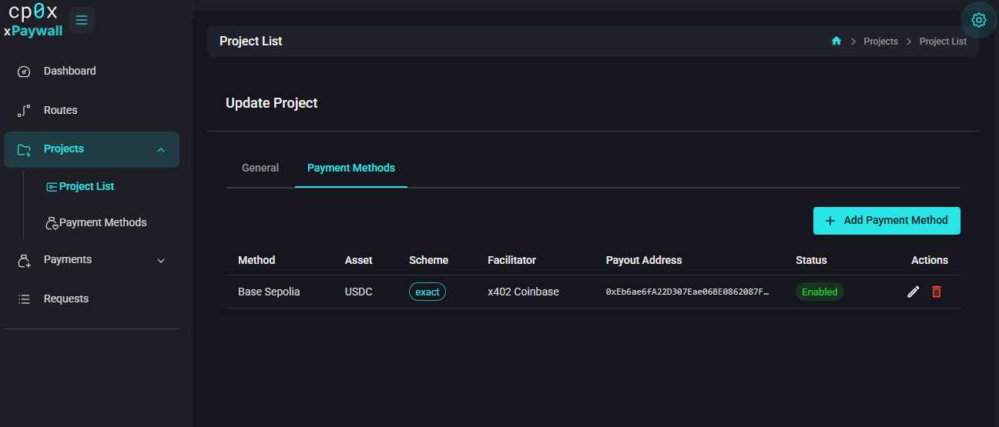

# Admin Panel — Project Payment Methods

This is the page where the global pieces (facilitator, payment method, asset) get attached to a specific project, with a **payout address** — the wallet that actually receives the money.

Until you create at least one Project Payment Method, paid routes on that project cannot work: the gateway has no idea where to send the funds. Free routes still work without it.

## Two ways to open the form

- Sidebar **Projects → Payment Methods** shows links across all projects.
- Or open a project and switch to the **Payment Methods** tab inside it.

Click **Add Payment Method** to open the dialog.

## Fields

| Field | What to put |
|---|---|
| **Payment Method** | Pick one of the global Payment Methods (e.g. `x402 Base Mainnet`). |
| **Asset** | Filtered to assets that belong to the chosen payment method. Pick the currency you accept, e.g. `USDC`. |
| **Scheme** | `exact` for now. `upto` and `batch-payment` are listed for forward compatibility but are not yet supported — see [11 — Roadmap](./../11-roadmap.md). |
| **Facilitator** | Pick a facilitator that supports the network of the chosen method. This is the verifier service that will check incoming payment proofs. |
| **Payout Address** | The wallet address that receives the payments on this network. Required for paid routes. Format depends on the chain — for EVM chains this is a `0x...` address. |
| **Enabled** | Leave on. Off keeps the row but stops it from being offered as a payment option to clients. |

> **Why the form filters assets.** Each asset belongs to exactly one payment method. Once you choose the method, only its assets appear in the next dropdown.

## What "exact" means

The `exact` scheme means the client signs and pays the exact USD price you set on the route — nothing more, nothing less, before the request is forwarded. It is the simplest mode and the only one xpaywall supports today.

`upto` (pay up to a maximum, settle the real consumption afterwards) and `batch-payment` (pay several requests in one signature) are planned. Selecting them in the form has no effect until they ship — see the roadmap.

## Why payout address matters

The gateway tells every paying client where to send the money. That address is the **payout address**. If you leave it blank or paste the wrong one:

- Best case: clients see a malformed 402 response and cannot pay.
- Worst case: you accept payments to a wallet you do not control.

## Multiple methods per project

You can attach several Project Payment Methods to the same project. The gateway will offer all of them in the 402 response and the client picks which one to pay with. Use this when you want to accept the same asset on different networks, or different assets.

## Edit / delete

The form lets you edit scheme, facilitator, payout address and the enabled flag. Payment Method and Asset are locked after creation — to change those, delete the row and add a new one. Disable a row instead of deleting it if you want to keep it as a temporary off-switch.

## What's next?

- Now that money has a place to land, define which paths are paid: [Routes](./08-routes.md).
- See it end-to-end with screenshots: [Guide 01 — Add your first paid route](./../06-guides/01-first-paid-route.md).
