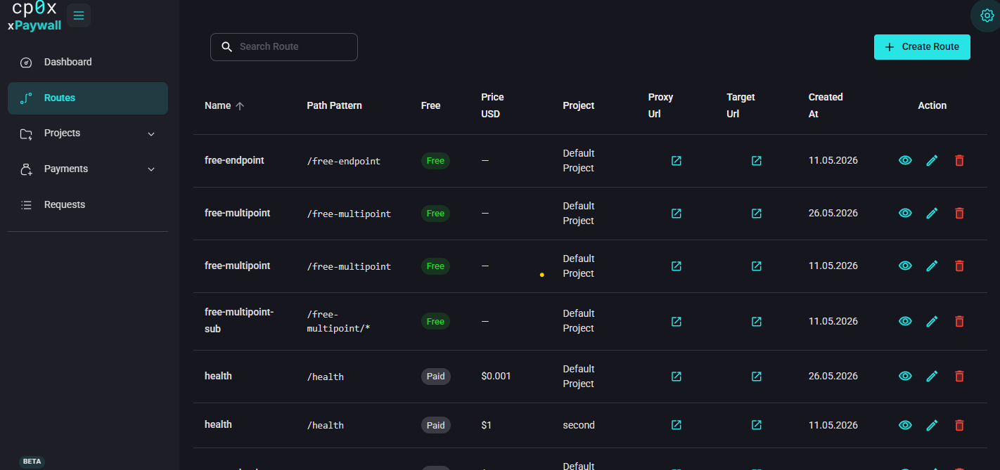
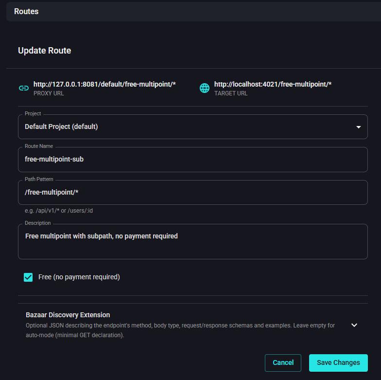
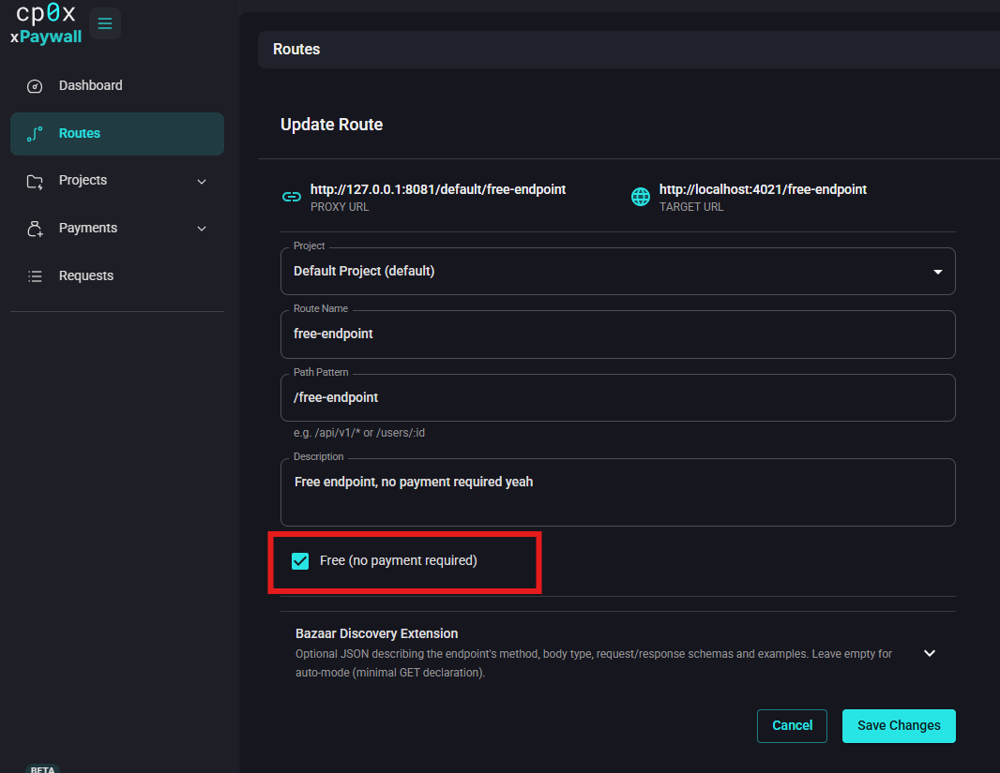
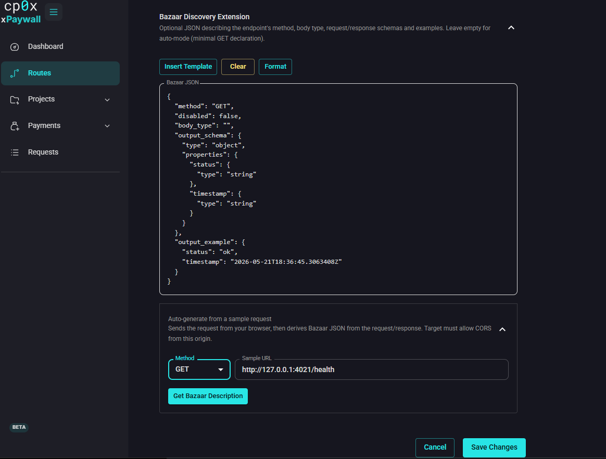

# Admin Panel — Routes

A **route** is one path (or path pattern) on a project. It tells the gateway:

- which incoming path to match,
- whether the route is free or priced,
- if priced, how much in USD.

Routes are where you actually monetise paths. A project with no routes does nothing useful.

## Creating a route

Open **Routes** in the sidebar and click **Create Route**.

At the top of the form you will see two live previews:

- **Proxy URL** — the URL clients will call (gateway + your username + project slug + path), i.e. `/{username}/{slug}/{path}`.
- **Target URL** — the URL the gateway will forward to (project base URL + path).

These update as you change the project and the path pattern. Use them to confirm the route is wired the way you expect.

## Fields

| Field | What to put |
|---|---|
| **Project** | Pick the project this route belongs to. Only projects you own appear in the list (superadmins see all). |
| **Route Name** | A human label, e.g. `Weather forecast`. Shown in the routes list and the request log. |
| **Path Pattern** | The path to match. Either an exact path like `/forecast` or a wildcard like `/api/v1/*`. See [Path patterns](#path-patterns) below. |
| **Description** | Optional. Sent inside the 402 response so paying clients know what they are buying. Free-form, keep it short. |
| **Free** | Tick to make the route free (no payment required). Hides the price field. |
| **Price (USD)** | Required when **Free** is off. A positive decimal in US dollars, e.g. `0.10` for ten cents. |
| **Bazaar Discovery Extension** | Optional JSON describing the endpoint's method, request body, response shape. See [Bazaar](#bazaar-discovery-extension) below. |

## Path patterns

xpaywall supports two kinds of patterns:

### Exact paths

`/health`, `/forecast`, `/api/v1/users` — the path matches one URL and nothing else.

Use exact paths for endpoints with a fixed URL. They are the most predictable and easiest to debug.

### Wildcards

`/api/v1/*`, `/files/*` — match any path that starts with the prefix.

The `*` is the same kind of glob you see in `path.Match` in Go: it matches one path segment by default, so `/api/v1/*` matches `/api/v1/foo` but not `/api/v1/foo/bar`. To match deeper, use a deeper pattern or several routes.

### Which wins when both match?

If two routes could match the same path — for example `/forecast` (exact) and `/*` (wildcard) — the gateway picks the most specific match. Exact paths beat wildcards.

For the full rules and edge cases see [Concepts → Route resolution](./../05-concepts.md#route-resolution).

## Free vs paid

Tick **Free** to make a route free. The price field disappears and the gateway skips the 402 step for that path — every request is forwarded straight to the upstream.

Use free routes for:
- Health checks (`/health`, `/ping`).
- Public metadata or schema endpoints.
- Endpoints that are gated some other way.

If you check **Free** and also enter a price, the price is ignored — **Free** wins. There is no "minimum free quota then pay" mode.

## Bazaar Discovery Extension

Bazaar is an optional x402 feature that lets facilitators catalogue your endpoint with rich metadata: HTTP method, request shape, response shape, examples. Paying clients can browse this catalogue before making a request.

You do not have to fill it in. When you leave **Bazaar** empty the gateway auto-generates a minimal declaration (`GET`, no schema). That is enough for the endpoint to be discoverable.

If you want to publish a real schema, click **Insert Template** for a starter, or use **Auto-generate from a sample request** to let the form fetch a real example response and infer the JSON schema for you.

Fields inside the Bazaar JSON:

| Field | What it means |
|---|---|
| `disabled` | If `true`, skip Bazaar discovery for this route. |
| `method` | HTTP method: `GET`, `POST`, `PUT`, `PATCH`, `DELETE`. |
| `body_type` | For `POST`/`PUT`/`PATCH`: `json`, `form-data` or `text`. Ignored for GET-style methods. |
| `input_example` | A concrete sample input. Becomes query params for GET, body for POST. |
| `input_schema` | JSON Schema validating the input. |
| `output_example` | A concrete sample response body. |
| `output_schema` | JSON Schema describing the response shape. |

If the JSON is invalid the form refuses to save and shows the parse error.

## Edit / delete

You can edit any field except the project. To move a route to another project, delete it and recreate it.

Deleting a route is instant. Existing in-flight requests finish, then new requests to that path return either `403 Forbidden` (default) or are proxied without payment (if **Allow Unmatched** is on for the project).

## Tips

- **Start with an exact path.** Wildcards are powerful but you can paint yourself into a corner. A handful of exact paths is usually clearer than one clever wildcard.
- **Match every path that should be reachable.** Anything you do not list returns `403`. That is by design — it forces you to think about what is public, what is free and what is paid.
- **Use the live URL preview.** It saves a lot of "why does this not match" debugging.

## What's next?

- Inspect what happened on the gateway: [Requests](./09-requests.md).
- Full step-by-step setup: [Guide 01 — Add your first paid route](./../06-guides/01-first-paid-route.md).
