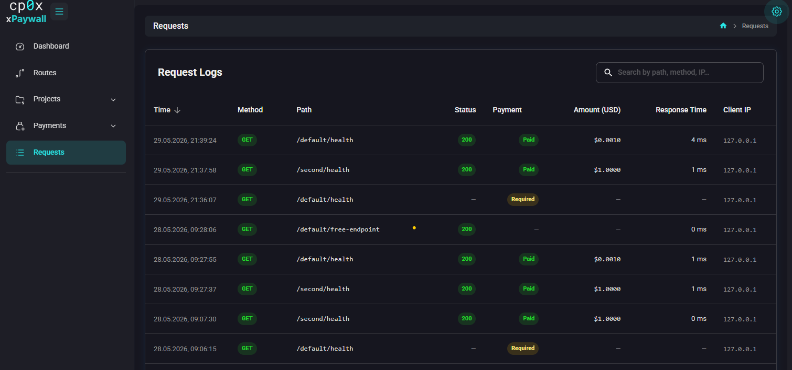

# Admin Panel — Requests

The **Requests** page is a log of every request that has gone through the gateway. Use it to debug payment problems, audit traffic, and confirm that a paid endpoint is actually being paid for.

> **Screenshot placeholder:** 

## The table

Each row is one client request. Columns typically include:

- **Time** — when the request hit the gateway.
- **Method** — HTTP method (GET, POST, ...).
- **Path** — the inbound path the client called.
- **Project / Route** — which configured route matched.
- **Status** — the final outcome:
  - `paid` — payment verified, upstream returned 2xx.
  - `free` — free route, proxied without payment.
  - `payment_required` — a 402 was returned (the client has not paid yet, or chose not to).
  - `upstream_error` — payment was fine but the upstream returned 4xx/5xx.
  - `error` — the gateway itself failed.
- **HTTP code** — the response the client got.
- **Latency** — total time from request to response, in milliseconds.
- **Amount** — when paid, the USD value charged.
- **Client IP** — the client's IP as seen by the gateway.

Sort, filter and paginate from the column headers. Use filters to narrow by status, project, route or time window when looking for a specific event.

## Request details

Click any row to open the request detail page.

> **Screenshot placeholder:** 

The detail page shows everything the gateway recorded:

- The full request line (method, path, query string).
- All response codes seen along the chain — including upstream status if it was reached.
- Latency broken down between gateway work and upstream work.
- Payment details when present: channel used, asset, on-chain amount, facilitator URL.
- Headers and user agent (when debug logging is on).

### Events / steps

A single request can pass through several middleware steps inside the gateway. The detail page shows them in order.

> **Screenshot placeholder:** 

Typical sequence for a paid request:

1. `route_resolved` — gateway found the matching rule for the path.
2. `payment_required` — first attempt with no proof; gateway returned 402.
3. `payment_completed` — second attempt with proof; facilitator verified the payment.
4. `proxying` — request forwarded to upstream.
5. `upstream_result` — upstream's status code and elapsed time.

For a free route you see just `route_resolved` → `proxying` → `upstream_result`.

If something went wrong, an `error` event with a message is recorded at the point of failure.

## Correlating 402 + retry

When a client gets a 402 and pays, the same logical request appears as two entries in the log: the 402, then the paid retry. The gateway tries to link them so the paid retry updates the same record instead of creating a duplicate. The link key is `method + path + client IP` with a 10-minute window.

If you see them as two separate rows: the client took longer than 10 minutes between 402 and retry, or came back from a different IP. Both are fine — the second one is the one that actually got served.

## Tips

- **No data shows up?** xpaywall logs requests only when it knows where to send them. In HTTP mode that is automatic. In file mode there is no central log store — the file-mode gateway prints to stdout and does not persist logs anywhere. See [08 — Troubleshooting](./../08-troubleshooting.md).
- **All requests are `payment_required`?** Either no client is actually completing the payment, or the facilitator is rejecting valid proofs. Open one of the rows and look at the events for the rejection reason.
- **`upstream_error` on every paid call?** The payment side is fine but your upstream is broken (wrong base URL, wrong auth header, real bug). Check the upstream directly with curl.

## What's next?

- Recipes to fix specific errors: [08 — Troubleshooting](./../08-troubleshooting.md).
- Glossary of every term used in the events: [10 — Reference](./../10-reference.md#glossary).
