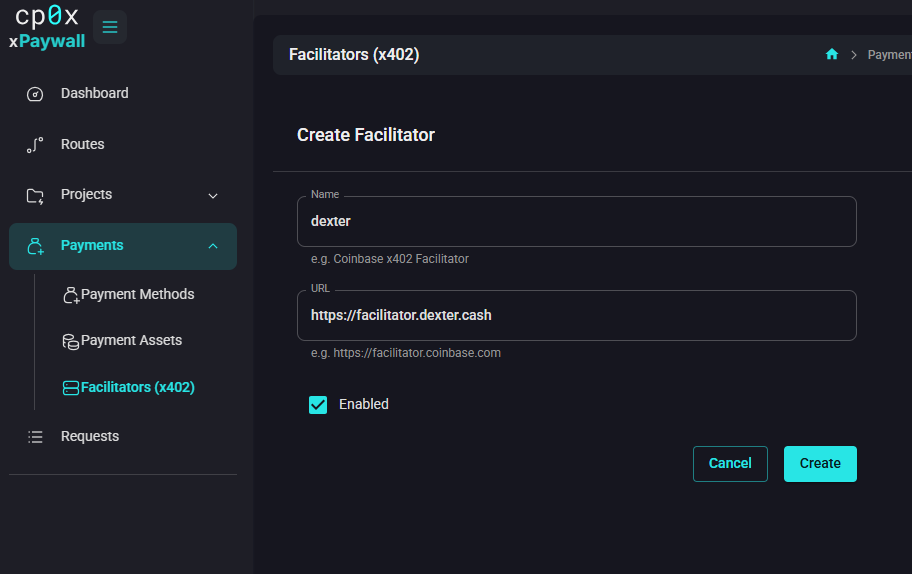
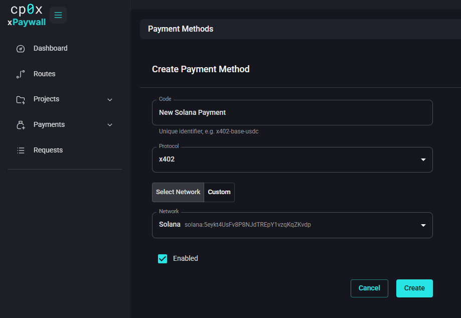
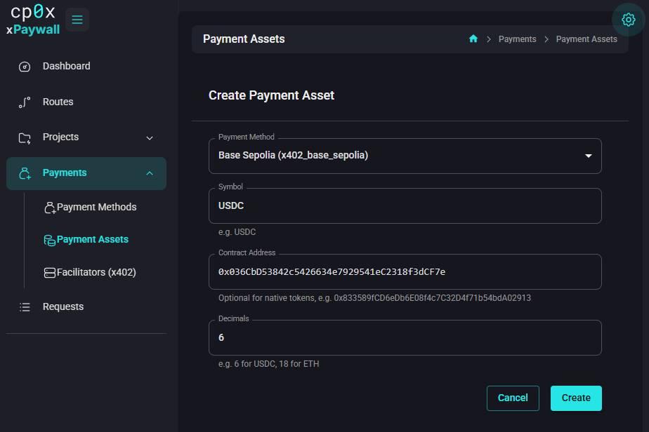
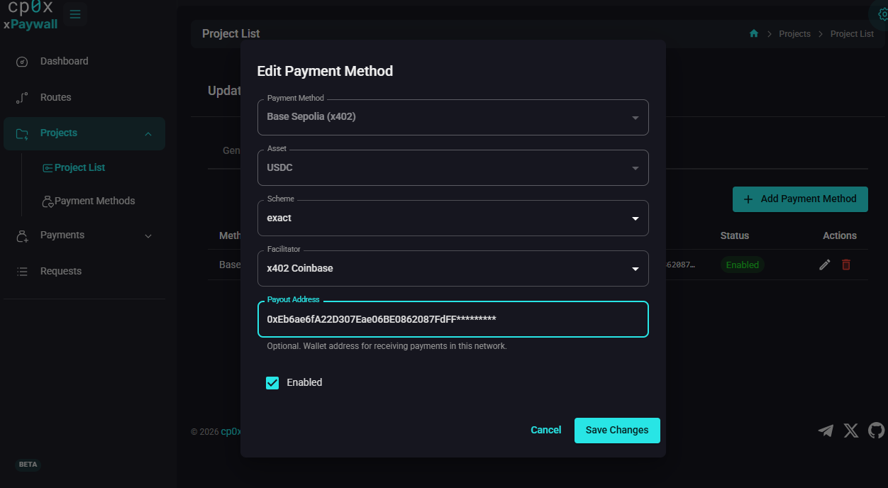
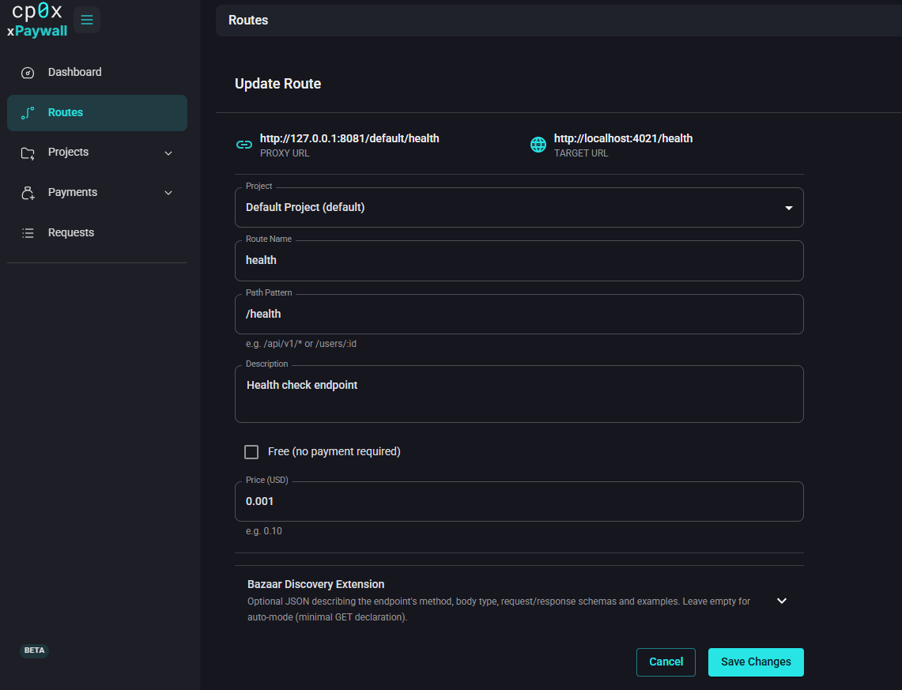

# Guide 01 — Add your first paid route

This guide goes from an empty admin panel to a working paid endpoint, end-to-end. It assumes:

- You have already followed [02 — Setup](./../02-setup.md) and the stack is running.
- The example upstream server is reachable at `http://localhost:3103` (or, from inside Docker, at `http://xpaywall-example-server:4021`).
- You are logged into the admin panel as a superadmin.

The endpoint you will create is a paid `/weather` route that, when called, forwards to the example upstream and charges `0.001` USDC on Base Sepolia.

Total time: about ten minutes.

## Step 1 — Add a facilitator

A facilitator verifies x402 payment proofs. You can use a public one for testing.

Open **Payments → Facilitators (x402)** and click **Create Facilitator**.



Fill in:

- **Name:** `x402 public facilitator`
- **URL:** `https://x402.org/facilitator`
- **Enabled:** on

Save.

## Step 2 — Add a payment method

A payment method defines the protocol + network. You will use x402 on Base Sepolia for testing.

Open **Payments → Payment Methods** and click **Create Payment Method**.



- **Code:** `x402-base-sepolia`
- **Protocol:** `x402`
- Switch the network toggle to **Select network** and pick `Base Sepolia`. (If it is missing from the list, switch to **Custom**, enter `Base Sepolia` as **Name** and `eip155:84532` as **CAIP-2 Chain ID**.)
- **Enabled:** on

Save.

## Step 3 — Add a payment asset

The asset is USDC on Base Sepolia.

Open **Payments → Payment Assets** and click **Create Payment Asset**.



- **Payment Method:** pick the method from Step 2 (`x402-base-sepolia`).
- **Symbol:** `USDC`
- **Contract Address:** `0x036CbD53842c5426634e7929541eC2318f3dCF7e`
- **Decimals:** `6`

Save.

## Step 4 — Create the project

Open **Projects → Project List** and click **Create Project**.


- **Project Name:** `Demo`
- **Slug:** `demo` (auto-suggested)
- **Server Base URL:** the upstream server url.
- Leave **Auth Header Name / Value** empty.
- Leave **Allow Unmatched Routes** unchecked.

> This guide assumes you are logged in as **`alice`**. The proxy URL includes your username, so the
> examples below use `/alice/demo/...`. Substitute your own login username.

Save. The project appears in the list.

## Step 5 — Attach a project payment method

Open the **Demo** project, switch to the **Payment Methods** tab, and click **Add Payment Method**.



- **Payment Method:** `x402-base-sepolia`
- **Asset:** `USDC`
- **Scheme:** `exact`
- **Facilitator:** `x402 public facilitator`
- **Payout Address:** paste the wallet address that should receive the test payment. For a throwaway address, generate one in MetaMask or any other wallet — just make sure you control it.
- **Enabled:** on

Save.

## Step 6 — Create the route

Open **Routes** in the sidebar and click **Create Route**.



- **Project:** `Demo`
- **Route Name:** `Weather`
- **Path Pattern:** `/weather`
- **Description:** `Returns the current weather (sample upstream)`
- **Free:** off
- **Price (USD):** `0.001`

Watch the **Proxy URL** and **Target URL** previews at the top of the form. They should look like:

- **Proxy URL:** `http://localhost:3102/alice/demo/weather`
- **Target URL:** `http://xpaywall-example-server:4021/weather`

Save.

## Step 7 — Test it

From a terminal:

```bash
curl -i http://localhost:3102/alice/demo/weather
```

You should see an HTTP `402 Payment Required` response with a JSON body containing payment requirements: network `eip155:84532`, asset USDC, payout address (yours), amount `1000` (= `0.001` USDC at six decimals), facilitator URL.

Now pay with an x402-aware client. Options:

- The `x402` Python or TypeScript SDK from the x402 ecosystem.
- A wallet integration that speaks x402 natively.

Once the client has paid, the same `GET /alice/demo/weather` with the `X-PAYMENT` header attached returns the upstream weather JSON.

> **Note:** You can open proxy url in browser and test it manually. x402 server shows you the payment form and after payment you will see the upstream server data.
> 
## Step 8 — See it in the admin panel

Open **Requests** in the sidebar. You should see one row for the 402 and another for the paid retry (or a single combined row if both arrived within the 10-minute correlation window).

The Dashboard now shows non-zero counters.

## Recap

You created six things in this order:

1. A **facilitator** — the verifier.
2. A **payment method** — protocol + network.
3. A **payment asset** — the currency.
4. A **project** — the upstream URL + slug.
5. A **project payment method** — link to a payout address.
6. A **route** — the path + price.

Every paid route in xpaywall is built the same way.

## What's next?

- Charge by URL pattern instead of one path at a time: [Guide 02 — Wildcard routes](./02-wildcard-routes.md).
- Hardening for production: [09 — Security](./../09-security.md).
